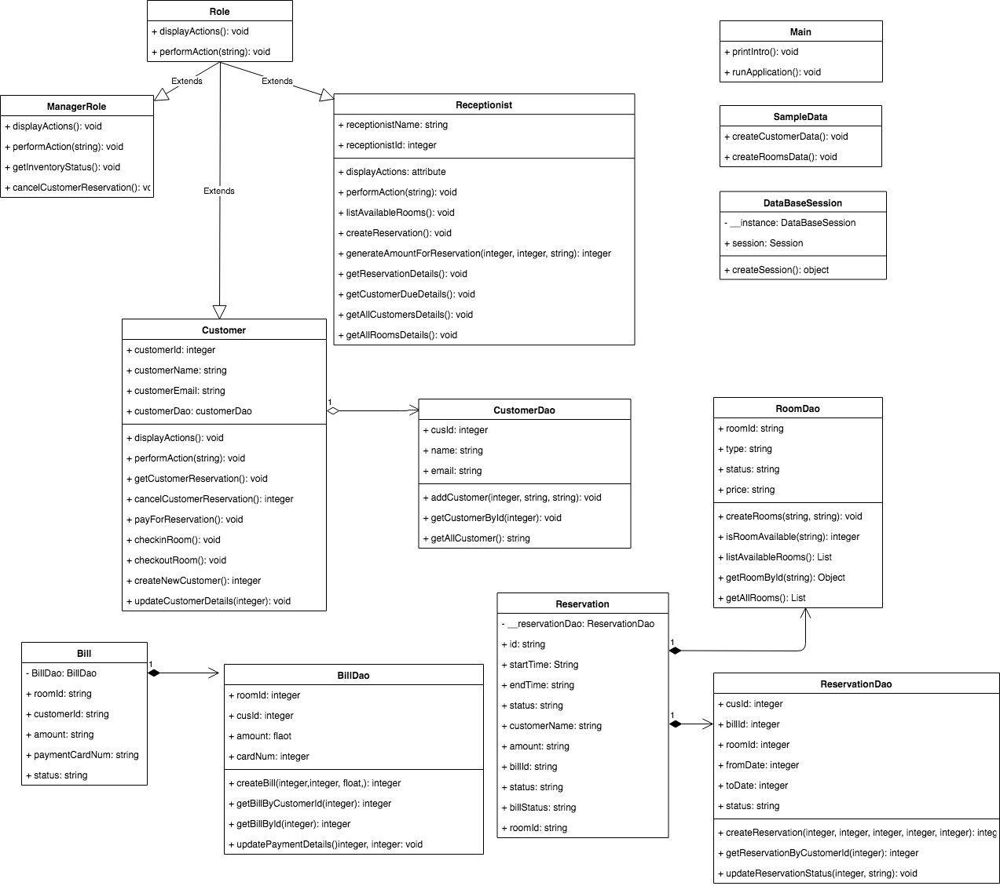
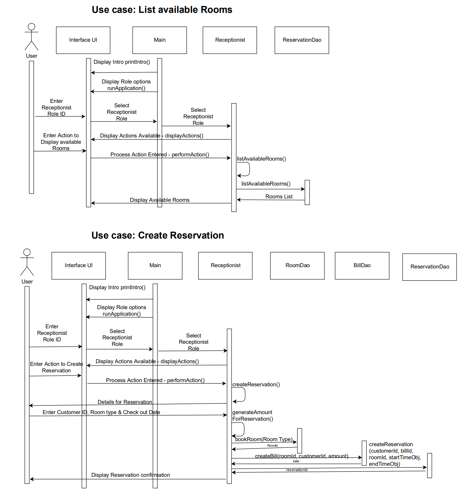
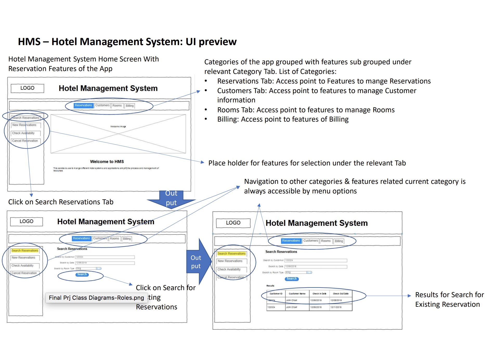

# Hotel Management System

# Scope

The scope of our final project is building an app to simplify the cumbersome hotel booking, room service, billing and hotel staff management. 
The app will feature following options for managing the Hotel:
1. Adding Room
2. Room Listing
3. Check room availability
4. Customer Registration
5. Customer Listing
6. Room Booking
7. Check Reservation
8. Cancel Reservation
9. Checkout Management
10.Billing Management

# Use cases for the Project

The use cases of the HMS is divided by 3 User roles which are Manager, Receptionist
and Customer. Below are the use cases categorized by each User role:
1) User Role - Manager

    a) Display Room Inventory
   
    b) Cancel Reservation
    
2) User Role - Receptionist

    a) List Available Rooms
    
    b) Create a Reservation
    
    c) Get Status of a Reservation for a customer
    
    d) Get bill due for a customer
    
    e) List all Customers
    
    f) List all Rooms
    
    g) Create a new Customer
    
    h) Update Customer Details
    
3) User Role - Customer

    a) Get my reservation details
    
    b) Cancel my reservation
    
    c) Pay the bill before check in
    
    d) Check in to a room
    
    e) Check out a room
    
# Class Diagram

# Sequence Diagram

# UI Sketch

